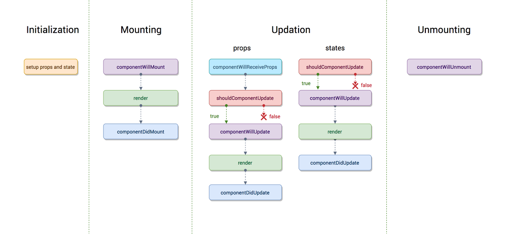

LifeCycle API
=================================================================

## **Intro**

    

위 다이어그램은 React 컴포넌트의 출생(pre-mounting)과 사망 (unmounting)에서의 Life Cycle입니다. React의 장점은 복잡한 UI를 작은 크기로 나누는 것입니다. 따라서 앱을 각각의 컴포넌트 단위로 분류 할 수 있을 뿐만 아니라 각 컴포넌트에 대해 customize 할 수 있습니다.

React Component의 라이프 사이클 메소드를 통해 UI의 각 컴포넌트가 렌더링(rendering), 업데이트(update), 재렌더링(re-rendering) 될 때를 고려할 수 있으며 완전히 사라질 때(unmount) 일어나는 일을 제어 할 수 있습니다.

## Mounting
React 컴포넌트의 인스턴스가 생성되고 DOM에 삽입되는 과정의 life cycle 입니다.

### 1.constructor
### 2.componentWillMount
### 3.render
### 4.componentDidMount

## Updating
prop 또는 state의 변경으로 해당 컴포넌트가 re-render 되는 경우의 life cycle 입니다.

## Props Change
### 1.componentWillReceiveProps
### 2.shouldComponentUpdate
### 3.componentWillUpdate
### 4.render
### 5.componentDidUpdate

## State Change
### 1.shouldComponentUpdate
### 2.componentWillUpdate
### 3.render
### 4.componentDidUpdate

## Unmounting
### 1.componentWillUnmount

이제 각각에 대해서 살펴봅시다.

## **constructor()**

이 부분은 컴포넌트 생성자 함수입니다.
컴포넌트가 새로 만들어질 때마다 이 함수가 호출됩니다.
~~~
constructor(props) {
  super(props);
}
~~~

## **[NEW] static getDerivedStateFromProps()**

이 함수는, v16.3 이후에 만들어진 라이프사이클 API 인데요, 
이 API 는 props 로 받아온 값을 state 로 동기화 하는 작업을 해줘야 하는 경우에 사용됩니다.
~~~
static getDerivedStateFromProps(nextProps, prevState) {

}
~~~

## **componentDidMount**

이 API 는 여러분의 컴포넌트가 화면에 나타나게 됐을 때 호출됩니다. 
여기선 주로 D3, masonry 처럼 DOM 을 사용해야하는 외부 라이브러리 연동을 하거나, 
해당 컴포넌트에서 필요로하는 데이터를 요청하기 위해 axios, fetch 등을 통하여 ajax 요청을 하거나, 
DOM 의 속성을 읽거나 직접 변경하는 작업을 진행합니다.
~~~
componentDidMount() {
    
}
~~~

## **shouldComponentUpdate()**

쓸대없이 낭비되고 있는 CPU 처리량을 줄여주기 위해서 우리는 Virtual DOM 에 리렌더링 하는것도,
불필요할경우엔 방지하기 위해서 shouldComponentUpdate 를 작성합니다.
이 함수는 기본적으로 true 를 반환합니다. 
우리가 따로 작성을 해주어서 조건에 따라 false 를 반환하면 해당 조건에는 render 함수를 호출하지 않습니다.
~~~
shouldComponentUpdate(nextProps, nextState) {

}
~~~

## **[NEW] getSnapshotBeforeUpdate()**

이 API를 통해서, DOM 변화가 일어나기 직전의 DOM 상태를 가져오고, 
여기서 리턴하는 값은 componentDidUpdate 에서 3번째 파라미터로 받아올 수 있게 됩니다.
~~~
getSnapshotBeforeUpdate(prevProps, prevState) {
  return a;
  }
~~~

## **componentDidUpdate()**

이 API는 컴포넌트에서 render() 를 호출하고난 다음에 발생하게 됩니다. 이 시점에선 this.props 와 this.state 가 바뀌어있습니다. 
그리고 파라미터를 통해 이전의 값인 prevProps 와 prevState 를 조회 할 수 있습니다. 
그리고, getSnapshotBeforeUpdate 에서 반환한 snapshot 값은 세번째 값으로 받아옵니다.
~~~
componentDidUpdate(prevProps, prevState, snapshot) {

}
~~~

## **componentWillUnmount()**

여기서는 주로 등록했었던 이벤트를 제거하고, 만약에 setTimeout 을 걸은것이 있다면 clearTimeout 을 통하여 제거를 합니다.
 추가적으로, 외부 라이브러리를 사용한게 있고 해당 라이브러리에 dispose 기능이 있다면 여기서 호출해주시면 됩니다.
~~~
componentWillUnmount() {
}
~~~

 ## ~~componentWillMount~~  _**deprecated**_ 

 이 API 가 더 이상 필요하지 않게 되어 리액트 v16.3 에서는 해당 API 가 _**deprecated**_ 되었습니다.

~~~
componentWillMount() {

}
~~~

## ~~componentWillUpdate()~~ _**deprecated**_ 

이 API 또한 v16.3 이후 _**deprecated**_  됩니다. 
~~~
componentWillUpdate(nextProps, nextState) {

}
~~~

## ~~componentWillReceiveProps~~  _**deprecated**_ 

이 API 또한 v16.3 부터  _**deprecated**_  됩니다.
~~~
componentWillReceiveProps(nextProps) {

}
~~~

### LifeCycle API
- LifeCycle API에 대한 설명 

### LifeCycle API2
- LifeCycle API 코드 작성 

